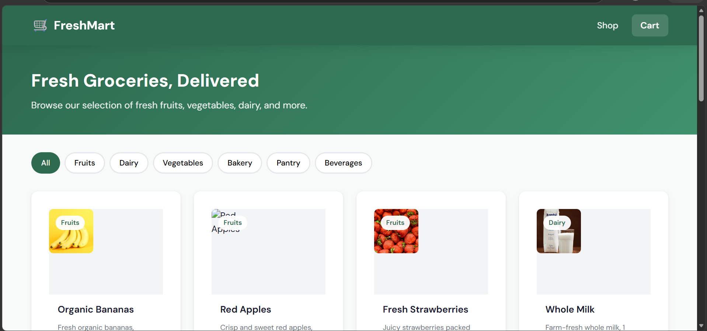

# 🛒 FreshMart Grocery App

A full-stack grocery shopping application where users can browse products, manage their cart, and place orders.

## 📸 Project Preview

<p align="center">
  
</p>

## 🚀 Tech Stack

- **Frontend:** React + Vite
- **Backend:** Node.js + Express
- **Storage:** In-memory storage
- **API:** REST API
- **Session Management:** Browser LocalStorage
- **Frontend Port:** 5173
- **Backend Port:** 3001

## ✨ Features

- 🛍️ Browse 16 grocery products across 6 categories
- 🔎 Filter products by category
- 🛒 Add products to cart
- 📦 Stock validation
- ➕ Update item quantities
- ❌ Remove items from cart
- 💳 Checkout with customer details
- 📍 Enter delivery address
- ✅ Order confirmation with order ID
- 🔐 Cart sessions tracked using `X-Session-Id`
- 📱 Responsive user interface

## ⚙️ Quick Start

### 1. Clone the repository

```bash
git clone https://github.com/ByteShivam-45/Grocery_app-.git
```

### 2. Navigate to the project

```bash
cd Grocery_app-
```

### 3. Install dependencies

```bash
npm run install:all
```

### 4. Start the application

```bash
npm run dev
```

The application will start with:

- Frontend → `http://localhost:5173`
- Backend → `http://localhost:3001`

Open the frontend in your browser:

```text
http://localhost:5173
```

## 🔌 API Endpoints

| Method | Endpoint | Description |
|---|---|---|
| GET | `/api/products` | Get all products |
| GET | `/api/products/:id` | Get a single product |
| GET | `/api/cart` | Get cart |
| POST | `/api/cart/items` | Add item to cart |
| PATCH | `/api/cart/items/:productId` | Update item quantity |
| DELETE | `/api/cart/items/:productId` | Remove item from cart |
| POST | `/api/orders` | Place an order |
| GET | `/api/orders/:id` | Get order details |

> Cart sessions are tracked using the `X-Session-Id` header, which is stored in the browser's LocalStorage.

## 📂 Project Structure

```text
Grocery_app-/
│
├── backend/
│   └── Express API
│
├── frontend/
│   └── React + Vite application
│
├── preview.png
├── package.json
├── package-lock.json
├── .gitignore
└── README.md
```

## 💾 Data Storage

The application currently uses **in-memory storage** for products, carts, and orders.

> Data will reset whenever the backend server is restarted.

## 🌐 Live Demo

Add your deployed frontend URL here:

```text
https://your-live-url.vercel.app
```

## 👨‍💻 Author

**Shivam Bhardwaj**

- GitHub: [ByteShivam-45](https://github.com/ByteShivam-45)

---

⭐ If you found this project useful, consider giving it a star!